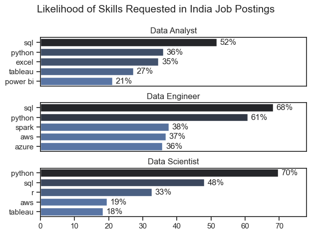
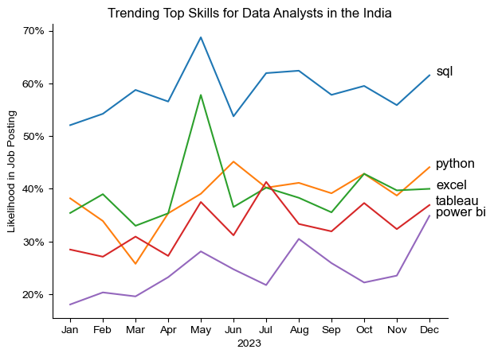
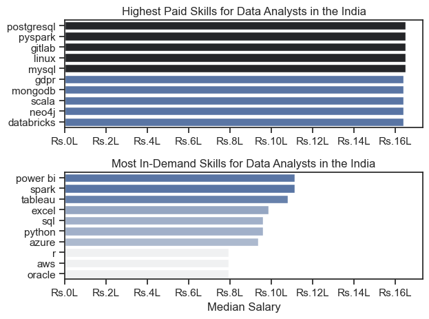
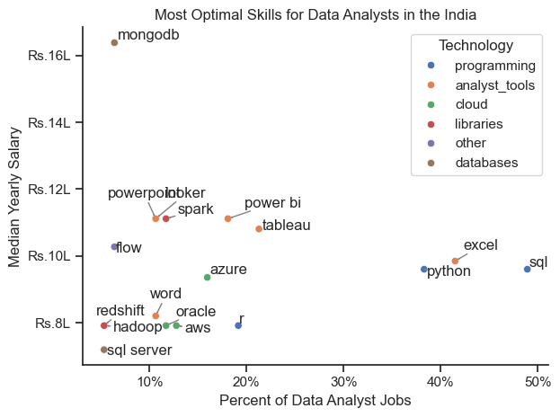

# Overview

Welcome to my analysis of the data job market, focusing on data analyst roles. This project was created out of a desire to navigate and understand the job market more effectively. It delves into the top-paying and in-demand skills to help find optimal job opportunities for data analysts.

# The Questions

Below are the questions I want to answer in my project:

1. What are the skills most in demand for the top 3 most popular data roles?
2. How are in-demand skills trending for Data Analysts?
3. How well do jobs and skills pay for Data Analysts?
4. What are the optimal skills for data analysts to learn? (High Demand AND High Paying) 

# Tools I Used

For my deep dive into the data analyst job market, I harnessed the power of several key tools:

- **Python:** The backbone of my analysis, allowing me to analyze the data and find critical insights.I also used the following Python libraries:
    - **Pandas Library:** This was used to analyze the data. 
    - **Matplotlib Library:** I visualized the data.
    - **Seaborn Library:** Helped me create more advanced visuals. 
- **Jupyter Notebooks:** The tool I used to run my Python scripts which let me easily include my notes and analysis.
- **Visual Studio Code:** My go-to for executing my Python scripts.
- **Git & GitHub:** Essential for version control and sharing my Python code and analysis, ensuring collaboration and project tracking.

# Data Preparation and Cleanup

This section outlines the steps taken to prepare the data for analysis, ensuring accuracy and usability.

## Import & Clean Up Data

I start by importing necessary libraries and loading the dataset, followed by initial data cleaning tasks to ensure data quality.

```python
# Importing Libraries
import ast
import pandas as pd
import seaborn as sns
from datasets import load_dataset
import matplotlib.pyplot as plt  

# Loading Data
dataset = load_dataset('lukebarousse/data_jobs')
df = dataset['train'].to_pandas()

# Data Cleanup
df['job_posted_date'] = pd.to_datetime(df['job_posted_date'])
df['job_skills'] = df['job_skills'].apply(lambda x: ast.literal_eval(x) if pd.notna(x) else x)
```

## Filter India Jobs

To focus my analysis on the Indian job market, I apply filters to the dataset, narrowing down to roles based in the India.

```python
df_US = df[df['job_country'] == 'India']

```

# The Analysis

Each Jupyter notebook for this project aimed at investigating specific aspects of the data job market. Here’s how I approached each question:

## 1. What are the most demanded skills for the top 3 most popular data roles?

To find the most demanded skills for the top 3 most popular data roles. I filtered out those positions by which ones were the most popular, and got the top 5 skills for these top 3 roles. This query highlights the most popular job titles and their top skills, showing which skills I should pay attention to depending on the role I'm targeting. 

View my notebook with detailed steps here: [2_Skill_Demand](2_Skill_Demand.ipynb).

### Visualize Data

```python
fig, ax = plt.subplots(len(job_titles), 1)


for i, job_title in enumerate(job_titles):
    df_plot = df_skills_perc[df_skills_perc['job_title_short'] == job_title].head(5)[::-1]
    sns.barplot(data=df_plot, x='skill_percent', y='job_skills', ax=ax[i], hue='skill_count', palette='dark:b_r')

plt.show()
```

### Results



*Bar graph visualizing the salary for the top 3 data roles and their top 5 skills associated with each.*

### Insights:

- SQL is the most requested skill for Data Analysts (52%) and is also highly demanded for Data Engineers (68%) and Data Scientists (48%), making it the most consistent skill across all three roles.

- Python dominates for Data Scientists (70%) and Data Engineers (61%), highlighting its role as the backbone programming language in advanced analytics and engineering tasks.
- Data Analysts lean more toward general-purpose tools like Excel (35%) and Tableau (27%), showing that business-facing analysis in India still relies heavily on reporting and visualization tools.
- Data Engineers show stronger demand for specialized technologies like Spark (38%), AWS (37%), and Azure (36%), which reflects the need for cloud and big data expertise in building data pipelines.
- Data Scientists balance between coding and statistical tools — besides Python and SQL, R (33%) is still relevant, although at lower demand compared to Python.

## 2. How are in-demand skills trending for Data Analysts?

To find how skills are trending in 2023 for Data Analysts, I filtered data analyst positions and grouped the skills by the month of the job postings. This got me the top 5 skills of data analysts by month, showing how popular skills were throughout 2023.

View my notebook with detailed steps here: [3_Skills_Trend](3_Skills_Trend.ipynb).

### Visualize Data

```python

from matplotlib.ticker import PercentFormatter

df_plot = df_DA_US_percent.iloc[:, :5]
sns.lineplot(data=df_plot, dashes=False, legend='full', palette='tab10')

plt.gca().yaxis.set_major_formatter(PercentFormatter(decimals=0))

plt.show()

```

### Results

  
*Bar graph visualizing the trending top skills for data analysts in the India in 2023.*

### Insights:
- SQL remains the most in-demand skill throughout 2023, consistently above 50%, despite some fluctuations.

- Excel shows a sharp spike in May, briefly surpassing all skills, but then stabilizes around the 40% mark by the year’s end.

- Python and Tableau display steady demand with minor ups and downs, both remaining crucial skills around the 35–40% range.

- Power BI, though less demanded than others, shows a gradual upward trend, especially in the last quarter of the year.

## 3. How well do jobs and skills pay for Data Analysts?

To identify the highest-paying roles and skills, I only got jobs in the India and looked at their median salary. But first I looked at the salary distributions of common data jobs like Data Scientist, Data Engineer, and Data Analyst, to get an idea of which jobs are paid the most. 

View my notebook with detailed steps here: [4_Salary_Analysis](4_Salary_Analysis.ipynb).

#### Visualize Data 

```python
sns.boxplot(data=df_US_top6, x='salary_year_avg', y='job_title_short', order=job_order)

ticks_x = plt.FuncFormatter(lambda y, pos: f'${int(y/1000)}K')
plt.gca().xaxis.set_major_formatter(ticks_x)
plt.show()

```

#### Results

  
*Box plot visualizing the salary distributions for the top 6 data job titles.*

#### Insights

- Senior Data Engineer and Machine Learning Engineer roles show the widest salary ranges, with high variability and several outliers, reflecting strong earning potential for specialized expertise.

- Data Scientist positions offer consistently high salaries, with a solid median around the mid-to-upper range, making it one of the most lucrative career paths.

- Data Analyst roles display narrower salary ranges and lower medians compared to other data jobs, indicating more predictable but modest compensation.

- Software Engineer salaries are comparatively lower and tightly clustered, showing less variation and growth potential than data-focused roles.

### Highest Paid & Most Demanded Skills for Data Analysts

Next, I narrowed my analysis and focused only on data analyst roles. I looked at the highest-paid skills and the most in-demand skills. I used two bar charts to showcase these.

#### Visualize Data

```python

fig, ax = plt.subplots(2, 1)  

# Top 10 Highest Paid Skills for Data Analysts
sns.barplot(data=df_DA_top_pay, x='median', y=df_DA_top_pay.index, hue='median', ax=ax[0], palette='dark:b_r')

# Top 10 Most In-Demand Skills for Data Analystsr')
sns.barplot(data=df_DA_skills, x='median', y=df_DA_skills.index, hue='median', ax=ax[1], palette='light:b')

plt.show()

```

#### Results
Here's the breakdown of the highest-paid & most in-demand skills for data analysts in the India:


*Two separate bar graphs visualizing the highest paid skills and most in-demand skills for data analysts in the India.*

#### Insights:

- The top graph indicates that advanced technical skills such as PostgreSQL, PySpark, GitLab, and Databricks are among the highest paid, with median salaries nearing ₹16L, reflecting the premium placed on specialized expertise.

- The bottom graph shows that Power BI, Spark, Tableau, Excel, and SQL are the most in-demand skills, underscoring their importance for employability in data analyst roles, even if they do not command the highest pay.

- A clear distinction emerges between high-paying specialized tools and widely demanded foundational skills. To maximize career growth, data analysts should focus on building a hybrid skill set that combines both.

## 4. What are the most optimal skills to learn for Data Analysts?

To identify the most optimal skills to learn ( the ones that are the highest paid and highest in demand) I calculated the percent of skill demand and the median salary of these skills. To easily identify which are the most optimal skills to learn. 

View my notebook with detailed steps here: [5_Optimal_Skills](5_Optimal_Skills.ipynb).

#### Visualize Data

```python
from adjustText import adjust_text
import matplotlib.pyplot as plt

plt.scatter(df_DA_skills_high_demand['skill_percent'], df_DA_skills_high_demand['median_salary'])
plt.show()

```

#### Results

    
*A scatter plot visualizing the most optimal skills (high paying & high demand) for data analysts in the India.*

#### Insights:

- `MongoDB` stands out as the highest-value niche skill, commanding a median salary of approximately Rs.16L despite appearing in less than 5% of job postings. This suggests extreme premium pricing for NoSQL database expertise in the data analyst market.
- `Python` and `SQL` represent the sweet spot for career growth, both appearing in 38-40% of job listings while maintaining competitive salaries around Rs.9.5-10L. This combination of high demand and strong compensation makes them essential skills for data analysts.
- Traditional tools like `Excel` show high market penetration but lower financial returns, with Excel appearing in roughly 42% of jobs but offering median salaries closer to Rs.10L. This indicates these are baseline requirements rather than differentiating skills.
- Specialized visualization and cloud tools occupy the middle ground, with skills like `Tableau`, `Power BI`, and `Azure` clustering around 15-20% job frequency and Rs.8-11L salary range, suggesting they're valuable supplementary skills that can boost earning potential without being universally required.

### Visualizing Different Techonologies

Let's visualize the different technologies as well in the graph. We'll add color labels based on the technology (e.g., {Programming: Python})

#### Visualize Data

```python
from matplotlib.ticker import PercentFormatter

# Create a scatter plot
scatter = sns.scatterplot(
    data=df_DA_skills_tech_high_demand,
    x='skill_percent',
    y='median_salary',
    hue='technology',  # Color by technology
    palette='bright',  # Use a bright palette for distinct colors
    legend='full'  # Ensure the legend is shown
)
plt.show()

```

#### Results

  
*A scatter plot visualizing the most optimal skills (high paying & high demand) for data analysts in the India with color labels for technology.*

#### Insights:

- MongoDB emerges as the ultimate premium skill, commanding the highest median salary at Rs.16L+ while appearing in less than 5% of job postings. This extreme salary-to-demand ratio indicates that NoSQL database expertise is exceptionally valued but rare in the Indian data analytics market.
- SQL and Excel dominate market penetration with solid returns, appearing in approximately 50% and 45% of job listings respectively while maintaining competitive salaries around Rs.9.5-10L. These foundational skills represent the baseline requirements that offer both job security and decent compensation in India's data analyst landscape.
- `Programming` skills create a high-value cluster, with Python positioned at nearly 40% job frequency and Rs.9.5L salary, while R shows lower market demand but similar compensation. This suggests programming proficiency is becoming increasingly essential for premium data analyst positions in India.
- Business intelligence tools occupy the strategic middle ground, with Power BI, Tableau, and Looker clustered around 15-25% job frequency and Rs.11-12L salary range. These analyst tools offer an attractive balance of moderate market demand with above-average compensation, making them valuable specialization areas for career advancement.

# What I Learned

Throughout this project, I deepened my understanding of the data analyst job market and enhanced my technical skills in Python, especially in data manipulation and visualization. Here are a few specific things I learned:

- **Advanced Python Usage**: Utilizing libraries such as Pandas for data manipulation, Seaborn and Matplotlib for data visualization, and other libraries helped me perform complex data analysis tasks more efficiently.
- **Data Cleaning Importance**: I learned that thorough data cleaning and preparation are crucial before any analysis can be conducted, ensuring the accuracy of insights derived from the data.
- **Strategic Skill Analysis**: The project emphasized the importance of aligning one's skills with market demand. Understanding the relationship between skill demand, salary, and job availability allows for more strategic career planning in the tech industry.


# Insights

This project provided several general insights into the data job market for analysts:

- **Premium skills create salary outliers:** Specialized database technologies like PostgreSQL, PySpark, and MongoDB command Rs.15-16L+ salaries despite appearing in <5% of job postings, while high-demand skills like SQL and Excel offer Rs.9-10L with 50%+ market presence.
- **Role-specific skill patterns emerge:** Data Scientists heavily favor Python (70%), Data Engineers need balanced SQL-Python expertise (68%-61%), while Data Analysts still rely on Excel and Tableau, indicating distinct career specialization paths rather than generic "data skills."
- **Market volatility demands adaptability:** 2023 trends show 20-30% fluctuations in skill demand for Python, Excel, and visualization tools, while SQL maintains stability at 52-70%, suggesting professionals must continuously monitor market shifts.
- **Technical depth drives compensation tiers:** Machine Learning Engineers and Senior Data Engineers earn Rs.10-15L+ median salaries, significantly outpacing traditional Data Analysts at Rs.6-10L, reflecting the premium placed on engineering capabilities over pure analytical skills.


# Challenges I Faced

This project was not without its challenges, but it provided good learning opportunities:

- **Data Inconsistencies**: Handling missing or inconsistent data entries requires careful consideration and thorough data-cleaning techniques to ensure the integrity of the analysis.
- **Complex Data Visualization**: Designing effective visual representations of complex datasets was challenging but critical for conveying insights clearly and compellingly.
- **Balancing Breadth and Depth**: Deciding how deeply to dive into each analysis while maintaining a broad overview of the data landscape required constant balancing to ensure comprehensive coverage without getting lost in details.


# Conclusion

This exploration into the data analyst job market has been incredibly informative, highlighting the critical skills and trends that shape this evolving field. The insights I got enhance my understanding and provide actionable guidance for anyone looking to advance their career in data analytics. As the market continues to change, ongoing analysis will be essential to stay ahead in data analytics. This project is a good foundation for future explorations and underscores the importance of continuous learning and adaptation in the data field.